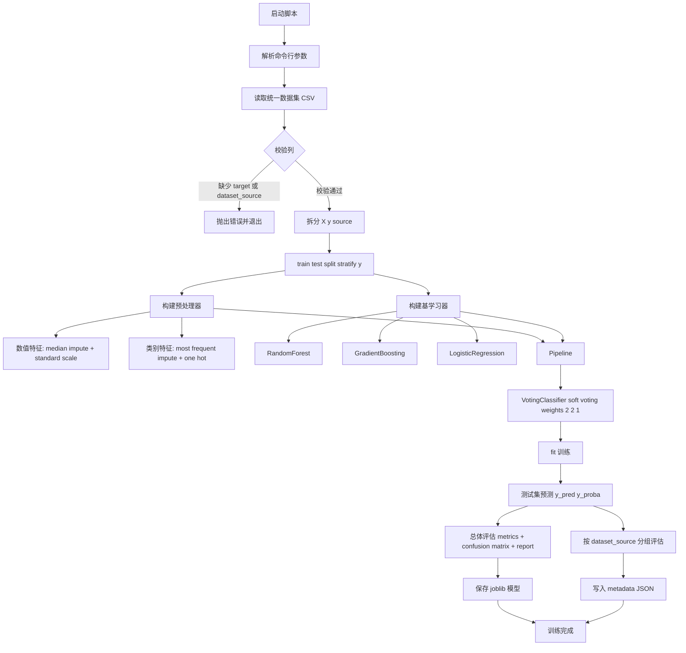

# CardioCheck 多数据源集成模型说明

本文档说明 `src/train_multisource_ensemble.py` 的训练逻辑、模型结构、输入输出、评估方式与可扩展方向。

## 1. 文档目标

- 解释训练脚本如何从统一数据集完成训练与评估
- 解释模型结构（预处理 + 三模型软投票集成）
- 说明关键参数、输出文件与结果解读
- 给出常见改造建议（泛化、可解释性、阈值策略）

## 2. 脚本职责概览

训练脚本：`src/train_multisource_ensemble.py`

职责分为 6 步：

1. 读取统一后的训练数据（要求 `target` 和 `dataset_source` 列存在）
2. 按标签分层划分训练集与测试集
3. 构建预处理器（数值/类别分支）
4. 构建并训练软投票集成模型
5. 输出总体评估与分数据源评估
6. 保存模型文件与元数据文件

## 3. 训练流程结构图



## 4. 模型结构详解

### 4.1 总体结构

脚本采用 `Pipeline(preprocessor -> model)`：

- `preprocessor`：统一完成缺失值处理、标准化、独热编码
- `model`：`VotingClassifier` 软投票集成

这保证了训练和推理使用同一套特征处理逻辑，避免线上线下不一致。

### 4.2 预处理层

1. 数值特征分支
- 缺失值：`SimpleImputer(strategy="median")`
- 归一化：`StandardScaler()`

2. 类别特征分支
- 缺失值：`SimpleImputer(strategy="most_frequent")`
- 编码：`OneHotEncoder(handle_unknown="ignore")`

3. 合并
- `ColumnTransformer` 将数值和类别分支拼接为统一特征矩阵

### 4.3 集成层

基学习器包含 3 个模型：

1. `RandomForestClassifier`
- 强项：抗噪、稳健、可处理复杂非线性
- 关键参数：`class_weight="balanced"`

2. `GradientBoostingClassifier`
- 强项：逐步优化残差，提升区分能力

3. `LogisticRegression`
- 强项：线性可分场景稳定，作为低方差补充模型
- 关键参数：`class_weight="balanced"`

融合方式：

- `VotingClassifier(voting="soft", weights=[2, 2, 1])`
- 使用概率加权平均形成最终正类概率

可写为：

$$
p = \frac{2p_{rf} + 2p_{gb} + 1p_{lr}}{5}
$$

其中 $p$ 是最终预测为高风险（`target=1`）的概率。

## 5. 训练与评估逻辑

### 5.1 数据读取与校验

- 读取 CSV 后检查：
  - 标签列 `target` 是否存在
  - 数据源列 `dataset_source` 是否存在

`dataset_source` 用于“分来源评估”，帮助判断模型在不同来源数据上的稳定性。

### 5.2 划分策略

- `train_test_split(..., stratify=y)`
- 作用：保持训练/测试中正负样本比例一致，降低偶然分布偏差。

### 5.3 输出指标

总体评估输出：

- Accuracy
- Precision
- Recall
- F1-score
- ROC-AUC
- Confusion Matrix
- Classification Report

分来源评估输出：

- 按 `dataset_source` 分组计算同类指标
- 每组样本数 < 10 时跳过，避免统计不稳定
- 若组内只有单一类别，AUC 记为 `nan`

## 6. 输入与输出文件

### 6.1 输入

默认输入：`data/processed/cardio_unified_merged.csv`

该文件至少应包含：

- `target`：二分类标签，0/1
- `dataset_source`：来源标识（如 uci、kaggle、hospital_a）
- 其余特征列（数值或类别）

### 6.2 输出

1. 模型文件
- 默认：`model/cardio_risk_multisource_ensemble.joblib`
- 内容：完整 pipeline（预处理 + 模型）

2. 元数据文件
- 默认：`model/cardio_risk_multisource_ensemble_meta.json`
- 内容：
  - 数据路径、标签名、特征列表
  - 训练/测试样本数
  - 总体指标
  - 分来源指标

## 7. 运行方式

```powershell
python src/train_multisource_ensemble.py
```

自定义参数示例：

```powershell
python src/train_multisource_ensemble.py --data data/processed/cardio_unified_merged.csv --target target --test-size 0.2 --output-model model/cardio_risk_multisource_ensemble.joblib --output-metadata model/cardio_risk_multisource_ensemble_meta.json
```

## 8. 结果解读建议

1. 若 Recall 高、Precision 低
- 模型更偏向“尽量少漏诊”，适合筛查。

2. 若 Precision 高、Recall 低
- 模型更保守，误报少但漏报可能升高。

3. 建议优先关注
- ROC-AUC（区分能力）
- 高风险类（1）的 Recall（漏诊控制）
- 分来源指标一致性（跨来源稳定性）

## 9. 当前实现的注意点

- 当前训练特征中包含 `dataset_source`（因为只删除了 `target`）。
- 这在多来源混合训练中可能提高指标，但也可能引入来源依赖。

如果目标是跨来源泛化，建议做对照实验：

1. 方案 A：保留 `dataset_source` 作为特征
2. 方案 B：从特征中移除 `dataset_source`
3. 比较两种方案在外部来源测试集上的表现

## 10. 可扩展方向

- 加入 XGBoost / LightGBM 形成更强集成
- 引入交叉验证和自动调参（如 Optuna）
- 阈值优化（根据业务成本调 Precision/Recall）
- 概率校准（Platt/Isotonic）
- 模型解释（SHAP）与特征漂移监控
